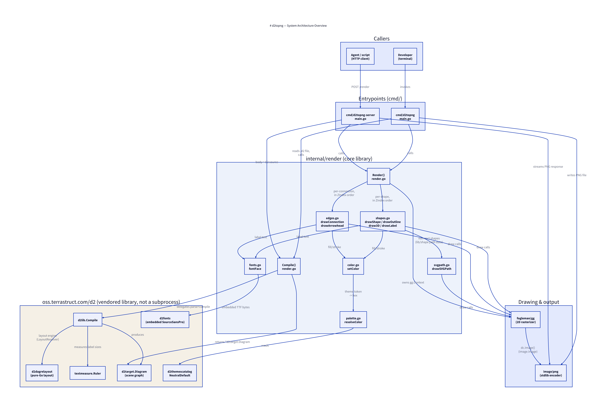

# Architecture Overview

`d2topng` renders [D2](https://d2lang.com) diagrams to PNG without a browser
or SVG intermediate step. `oss.terrastruct.com/d2` is used purely as a Go
*library* — for parsing, graph compilation, layout, and text measurement —
never shelled out to as a subprocess and never asked to produce SVG or HTML.
All actual pixel drawing is native Go, via
[`fogleman/gg`](https://github.com/fogleman/gg) (a Go wrapper around
`freetype/raster`), encoded with the standard library's `image/png`.

There are two entrypoints (`cmd/d2topng` and `cmd/d2topng-server`) that share
one core library, `internal/render`.

## The two entrypoints

Both entrypoints do the exact same three-step dance around the shared
library, differing only in where the D2 source comes from and where the PNG
goes:

| Step | `cmd/d2topng` (CLI) | `cmd/d2topng-server` (HTTP) |
|---|---|---|
| Get D2 source | `os.ReadFile(inPath)` | HTTP request body |
| Compile + render | `render.Compile` → `render.Render` | same |
| Emit PNG | `png.Encode` to a created file | `png.Encode` to the response writer |

See [CLI](02-cli.md) and [HTTP Server](03-server.md) for the full flow of
each, including their respective error handling.

## `internal/render` — the shared core

Everything renderer-specific lives under `internal/render`, deliberately an
*internal* package: it's implementation detail for the two `cmd/` binaries,
not a public API for other Go programs to import.

| File | Responsibility |
|---|---|
| `render.go` | `Compile()` (D2 source → scene graph) and `Render()` (scene graph → image), plus the package-level `outputScale` supersampling factor |
| `shapes.go` | Drawing every shape type: rectangles, ovals, generic D2 shapes (diamond, cylinder, etc.), shadows, "multiple", 3D, double borders, labels |
| `edges.go` | Drawing connections: straight/curved routes, arrowheads, edge labels |
| `color.go` | `setColor()` — resolving a D2 color field to a `gg` drawing color, honoring opacity |
| `palette.go` | `resolveColor()` — mapping D2's theme-slot tokens (`"B6"`, `"N1"`, ...) to hex, plus the single hardcoded theme |
| `fonts.go` | Loading D2's own embedded SourceSansPro font bytes into scaled `font.Face`s |
| `svgpath.go` | Replaying D2's own SVG path mini-language (`M`/`L`/`H`/`V`/`C`/`Z`) as `gg` draw calls, so non-rectangular shape geometry is reused from D2 rather than reimplemented |

## Why a library, not a subprocess

Because `d2lib.Compile` is called in-process, there's no dependency on a `d2`
binary being installed, no subprocess spawn/pipe overhead, and no
serialization round-trip through SVG text. The tradeoff (documented in the
repo's `PLAN.md`) is that this renderer only supports the subset of D2
visual features it has explicitly implemented — no markdown labels, no
sketch mode, no icons/images, no theme selection beyond D2's default. See
[Color & Fonts](08-color-and-fonts.md) for the theme point specifically.

## Dependency direction

`internal/render` depends on `oss.terrastruct.com/d2`'s subpackages
(`d2lib`, `d2graph`, `d2target`, `d2dagrelayout`, `d2themescatalog`,
`d2fonts`, `lib/geo`, `lib/shape`, `lib/svg`, `lib/label`,
`lib/textmeasure`) purely for parsing/layout/theme data — never for
rendering. Every actual draw call goes through `fogleman/gg`. This is the
architectural line that keeps the renderer "native": D2 builds the *scene
graph*, `d2topng` decides how every pixel of it gets painted.
