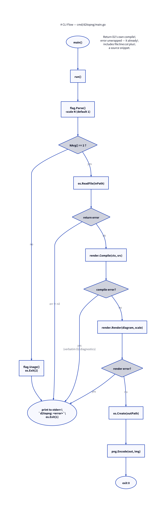

# CLI: `cmd/d2topng`

Source: [`cmd/d2topng/main.go`](../cmd/d2topng/main.go) (65 lines).

The single-shot command-line tool. It has exactly one job — turn one `.d2`
file into one `.png` file — and the whole file reflects that: a `main()`
that delegates to `run() error` so errors have one exit path, and a flat,
linear sequence of steps with no branching beyond argument validation.



## Flag handling

```go
scale := flag.Float64("scale", 1, "output resolution multiplier (e.g. 2 for double-resolution PNG)")
```

`-scale` and `-version` are the two flags. A custom `flag.Usage` prints the
two-positional-argument usage line
(`d2topng [-scale N] <input.d2> <output.png>`) before the auto-generated
flag defaults. `-version` is checked immediately after `flag.Parse()`,
before the positional-argument count check, so `d2topng -version` exits
successfully with no `.d2`/`.png` arguments needed. Otherwise, if
`flag.NArg() != 2`, usage is printed and the process exits `2` — the
conventional Unix exit code for "bad invocation," distinct from the `1`
used for runtime failures further down.

### `-version`

```go
func versionString() string {
    if version != "" {
        return "d2topng " + version
    }
    if info, ok := debug.ReadBuildInfo(); ok {
        var revision string
        dirty := false
        for _, s := range info.Settings {
            switch s.Key {
            case "vcs.revision": revision = s.Value
            case "vcs.modified": dirty = s.Value == "true"
            }
        }
        if revision != "" {
            if len(revision) > 12 { revision = revision[:12] }
            if dirty { revision += "-dirty" }
            return "d2topng dev+" + revision
        }
    }
    return "d2topng unknown"
}
```

`version` is a package-level `var version = ""`, meant to be overridden at
build time via `-ldflags "-X main.version=..."`. `make build` does exactly
that, stamping `git describe --tags --dirty --always` in as the version. A
plain `go build ./cmd/d2topng` or `go install ./cmd/d2topng` (the install
command this repo's own docs recommend) passes no such ldflags, so
`version` stays empty and `versionString` falls back to
`runtime/debug.ReadBuildInfo()` — which Go populates automatically with the
VCS commit the source tree was at when built, *as long as `-trimpath`
wasn't used* (the `make build` target does use `-trimpath`, which is why it
needs the explicit `-X` stamp instead of relying on this fallback).

This exists specifically to make stale-binary drift visible at the CLI
itself — see [Testing Strategy](09-testing.md#a-discovered-pitfall-stale-installed-binaries-produce-silently-wrong-output)
for the incident that motivated it. Running `d2topng -version` next to
`git log -1 --format=%h` in the source tree now answers "is my installed
binary actually current?" without a rebuild-and-compare.

## The three fallible steps

1. **Read the file** — `os.ReadFile(inPath)`. Wrapped with
   `fmt.Errorf("read %s: %w", inPath, err)` so the failing path is always in
   the error text.
2. **Compile** — `render.Compile(context.Background(), string(src))`. See
   [Compile Pipeline](04-compile.md). Notably, this error is returned
   **unwrapped**:

   ```go
   diagram, err := render.Compile(context.Background(), string(src))
   if err != nil {
       // D2's own compile errors are already well-formatted (file:line:col
       // plus a source snippet) — surfaced verbatim rather than wrapped so
       // none of that context is lost.
       return err
   }
   ```

   This is a deliberate exception to the "wrap every error" pattern used
   elsewhere in the file: D2's compiler diagnostics are already
   multi-line, human-formatted text with a source snippet, and prefixing
   them with `"compile: %w"` would visually break that formatting for no
   benefit.
3. **Render and encode** — `render.Render(diagram, *scale)` (see
   [Render Pipeline](05-render-pipeline.md)), then `os.Create(outPath)` and
   `png.Encode(out, img)`, both wrapped with context in the same style as
   step 1.

## Error surface

`main()` is the only place `os.Exit` is called on failure:

```go
func main() {
    if err := run(); err != nil {
        fmt.Fprintln(os.Stderr, "d2topng:", err)
        os.Exit(1)
    }
}
```

Every error from `run()` — file I/O, D2 compile errors, render errors, PNG
encode errors — funnels through this one line, printed to stderr prefixed
with the program name, exit code `1`. There is no partial/best-effort output
mode: any failure at any step means no PNG is written (or an incomplete one
from a failed mid-write, since `out` is only closed via `defer` and errors
from `Close()` itself are not checked — see note below).

> **Note for future changes:** `defer out.Close()` discards the `Close()`
> error. For a local filesystem this is very unlikely to matter (data is
> already handed to `png.Encode`'s successful `Write` calls before `Close`
> is reached), but on network filesystems a failed `Close` can mean data
> loss that this code would currently report as success.
