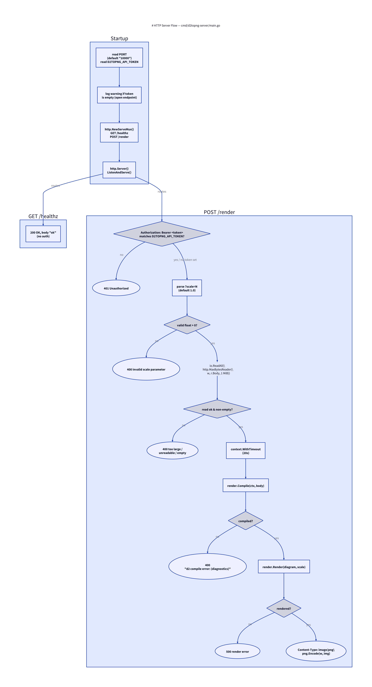

# HTTP Server: `cmd/d2topng-server`

Source: [`cmd/d2topng-server/main.go`](../cmd/d2topng-server/main.go) (110
lines), tested by
[`cmd/d2topng-server/main_test.go`](../cmd/d2topng-server/main_test.go).

Exposes the same `render.Compile` → `render.Render` pipeline as the CLI, as
a plain HTTP service — deliberately *not* MCP, so that any HTTP-capable
client (`curl`, a script, an agent) can use it without protocol-specific
client support. This is the same design used by the live deployment at
`d2topng.onrender.com`.



## Startup

```go
port := os.Getenv("PORT")
if port == "" {
    port = "10000" // Render's own documented default
}
```

`PORT` defaults to `10000` specifically because that's Render.com's own
documented default — this server is designed to run there (see
`render.yaml` at the repo root), though nothing else about it is
Render-specific.

`D2TOPNG_API_TOKEN` is read once at startup. If empty, a warning is logged
and `/render` runs **unauthenticated** — acceptable for local development,
explicitly called out as "not recommended for a public deployment" in the
repo README.

The `http.Server` is configured with explicit timeouts rather than the
zero-value (infinite) defaults:

```go
srv := &http.Server{
    Addr:              ":" + port,
    Handler:           mux,
    ReadTimeout:       10 * time.Second,
    WriteTimeout:      30 * time.Second,
    ReadHeaderTimeout: 5 * time.Second,
}
```

`WriteTimeout` (30s) is longer than `ReadTimeout` (10s) because rendering a
large diagram and streaming back a PNG can legitimately take longer than
reading a request body.

## `GET /healthz`

Trivial liveness check — `200 OK`, body `"ok"`, no authentication. Used by
Render's own health check mechanism (`healthCheckPath: /healthz` in
`render.yaml`) as well as anything else polling for liveness.

## `POST /render`

`handleRender(token string) http.HandlerFunc` is a handler *factory* — the
token is captured once at startup and closed over, rather than re-read from
the environment on every request.

Request handling, in order:

1. **Auth.** If `token != ""`, the request must carry
   `Authorization: Bearer <token>` exactly, else `401`. If `token == ""`
   (unset at startup), this check is skipped entirely.
2. **Scale.** `?scale=N` is parsed as a `float64`; missing means `1.0`.
   Invalid or non-positive values are rejected with `400` — this is the only
   way to set scale over HTTP; there is no request-header equivalent, so
   e.g. a stray `X-Scale` header is silently ignored.
3. **Body size.** The body is read through
   `http.MaxBytesReader(w, r.Body, maxSourceBytes)`, where
   `maxSourceBytes = 1 << 20` (1 MiB). This is a deliberate, simple abuse
   guard — "1 MiB of D2 source is already an enormous diagram" — rather than
   any external rate limiting.
4. **Empty body.** Explicitly rejected with `400` and a message telling the
   caller to POST D2 source as the raw body (there's no JSON envelope or
   multipart form — the whole request body *is* the D2 source).
5. **Compile**, under a `context.WithTimeout(r.Context(), 20*time.Second)` —
   bounds how long a single request can occupy a compile+layout cycle.
   Failure returns `400` with D2's own diagnostic text as the body (same
   "surface verbatim" philosophy as the CLI — see
   [CLI](02-cli.md#the-three-fallible-steps)).
6. **Render.** Failure here is a `500` (an internal invariant broken by the
   renderer itself, not a caller input problem — contrast with the `400`s
   above, which are all about invalid request input).
7. **Respond.** `Content-Type: image/png`, then `png.Encode(w, img)`
   directly to the `ResponseWriter` — no buffering the whole PNG in memory
   first. Because headers (including the `200` status, implicit on first
   write) are already sent by the time encoding starts, an encode failure at
   this point can only be logged server-side (`log.Printf`), not turned into
   an HTTP error response.

## Tests

`main_test.go` exercises the handlers directly via `httptest`, without
starting a real listener:

- `TestHandleHealthz` — status `200`.
- `TestHandleRenderRequiresToken` — both "no `Authorization` header" and
  "wrong token" cases return `401`.
- `TestHandleRenderSuccess` — a minimal valid diagram returns `200`,
  `Content-Type: image/png`, and a body starting with the PNG magic bytes
  (`\x89PNG`).
- `TestHandleRenderEmptyBody`, `TestHandleRenderInvalidD2`,
  `TestHandleRenderInvalidScale` — each of the `400` paths.

## Deployment

`render.yaml` at the repo root is a Render.com Blueprint:

```yaml
services:
  - name: d2topng
    type: web
    runtime: go
    plan: free
    buildCommand: go build -tags netgo -ldflags '-s -w' -o bin/server ./cmd/d2topng-server
    startCommand: ./bin/server
    healthCheckPath: /healthz
    envVars:
      - key: D2TOPNG_API_TOKEN
        sync: false
```

`sync: false` on `D2TOPNG_API_TOKEN` means the actual secret value is set in
the Render dashboard, never committed to the repo or the Blueprint file
itself. Connecting the GitHub repo via Render's "New → Blueprint" flow picks
this file up with no further configuration needed beyond setting that one
secret.
