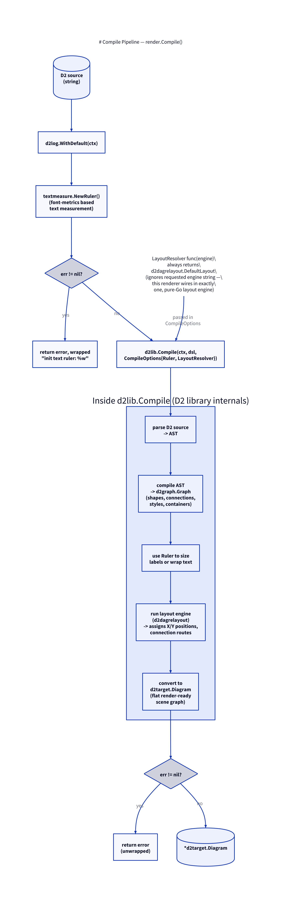

# Compile Pipeline: `render.Compile`

Source: [`internal/render/render.go`](../internal/render/render.go) lines
32–53.

```go
func Compile(ctx context.Context, dsl string) (*d2target.Diagram, error)
```

Turns raw D2 source text into a `*d2target.Diagram` — D2's own flat,
render-ready scene graph (shapes with resolved positions/sizes, connections
with resolved routes, all style fields as literal tokens). Everything after
this point (`render.Render` and everything it calls) works purely off that
struct and never touches D2's parser, graph model, or layout engine again.



## Steps

1. **`d2log.WithDefault(ctx)`** — attaches D2's default logger to the
   context. D2's internal compile/layout code logs through this context
   value rather than a global logger.

2. **`textmeasure.NewRuler()`** — constructs a font-metrics-based text
   ruler. D2 uses this during compilation to size labels and decide where
   to wrap text, so that by the time a `d2target.Diagram` comes out, label
   dimensions (`LabelWidth`/`LabelHeight`) and any inserted line breaks are
   already final. A failure here (e.g. missing font metrics) is wrapped and
   returned immediately: `fmt.Errorf("init text ruler: %w", err)`.

3. **`d2lib.Compile(ctx, dsl, &d2lib.CompileOptions{...}, nil)`** — the
   actual parse + compile + layout call into the D2 library. Two options are
   set:

   - `Ruler: ruler` — the ruler constructed above.
   - `LayoutResolver: func(engine string) (d2graph.LayoutGraph, error) { return d2dagrelayout.DefaultLayout, nil }`

   The `LayoutResolver` **ignores the `engine` argument entirely** and
   always returns `d2dagrelayout.DefaultLayout`. D2 normally supports
   selecting a layout engine per-diagram (e.g. via a `layout-engine`
   directive, historically also ELK or dagre-via-WASM); this renderer wires
   in exactly one — the pure-Go `d2dagrelayout` — regardless of what a `.d2`
   file might request. This is consistent with the project's stated goal of
   having zero non-Go runtime dependencies (no JVM for ELK, no WASM
   runtime).

4. **Error handling.** If `d2lib.Compile` fails, the error is returned
   **unwrapped** — same rationale as in the [CLI](02-cli.md): D2's compile
   diagnostics are already formatted with file:line:col and a source
   snippet, and wrapping would degrade that.

5. **Return** the resulting `*d2target.Diagram`.

## What happens inside `d2lib.Compile`

This is D2 library internals, not this repo's code, but understanding the
shape of it clarifies what `d2target.Diagram` actually contains by the time
`render.Render` sees it:

- Parse D2 source into an AST.
- Compile the AST into a `d2graph.Graph` — shapes, connections, containers,
  styles, still in a form that understands nesting/scoping.
- Measure labels via the `Ruler`, potentially wrapping text.
- Run the resolved layout engine (`d2dagrelayout` here) to assign concrete
  `X`/`Y` positions to every shape and a concrete point-list `Route` to
  every connection.
- Flatten everything into a `d2target.Diagram`: a scene graph with no more
  hierarchy concerns, only `Shapes []d2target.Shape` and
  `Connections []d2target.Connection`, each carrying literal geometry and
  literal (if theme-token) style fields.

Because layout and text measurement are both pure-Go and deterministic
given the same input, `render.Compile` followed by `render.Render` produces
byte-identical PNGs run to run — the basis for the golden-image tests (see
[Testing Strategy](09-testing.md)).
