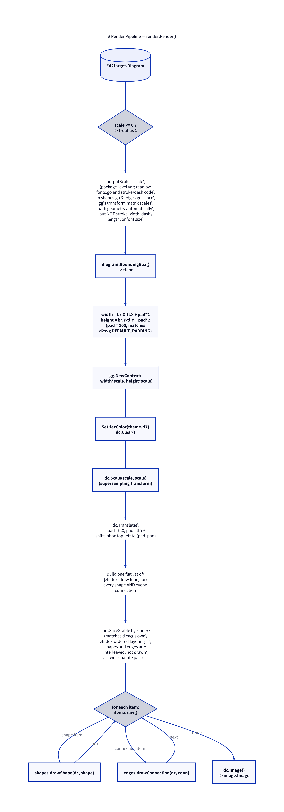

# Render Pipeline: `render.Render`

Source: [`internal/render/render.go`](../internal/render/render.go) lines
55–98.

```go
func Render(diagram *d2target.Diagram, scale float64) (image.Image, error)
```

Turns a compiled `*d2target.Diagram` into an in-memory `image.Image` by
drawing every shape and connection onto a `gg.Context`. This is the one
function that owns the `gg.Context` and the coordinate-space setup that
every other drawing function ([shapes.go](06-shapes.md),
[edges.go](07-edges.md)) relies on already being correct.



## Scale and `outputScale`

```go
if scale <= 0 {
    scale = 1
}
outputScale = scale
```

`outputScale` is a **package-level variable**, not a parameter threaded
through every drawing function. This is a load-bearing shortcut, documented
directly in the source:

> gg's transform matrix (set via `dc.Scale` below) automatically scales all
> shape/path geometry, but NOT stroke width, dash lengths, or font size —
> those are applied in device pixels rather than transformed path
> coordinates, so `fonts.go` and the stroke/dash call sites in
> `shapes.go`/`edges.go` read this to scale themselves explicitly.

In other words: `dc.Scale(scale, scale)` (below) makes every `MoveTo`,
`LineTo`, rectangle, etc. automatically land at the right device pixel — but
`gg`'s `SetLineWidth`, `SetDash`, and font point sizes are specified in
*device* pixels and are unaffected by that transform. Those call sites
(`fillAndStroke` in shapes.go, the stroke setup in `drawConnection` in
edges.go, and `fontFace` in fonts.go) each multiply by `outputScale`
explicitly to compensate. Being a package-level var is safe only because
`Render` is never called concurrently within a single process — true for
both the CLI (one render per process invocation) and the HTTP server (each
request compiles+renders in its own goroutine, but see the caveat below).

> **Concurrency caveat:** `cmd/d2topng-server` handles each request in its
> own goroutine, and `net/http` will run those concurrently for simultaneous
> requests. If two requests with different `-scale` values are in flight at
> the same time, they race on this package-level `outputScale`, and a
> request could pick up the *other* request's scale for its stroke widths,
> dash lengths, or font sizes. This wouldn't corrupt memory or crash — `gg`
> operations are otherwise per-`Context` — but it could produce a visibly
> wrong (mis-scaled strokes/text) PNG under concurrent load with mixed
> scale values.

## Bounding box and canvas size

```go
tl, br := diagram.BoundingBox()
width := br.X - tl.X + pad*2
height := br.Y - tl.Y + pad*2
```

`pad = 100`, chosen specifically to match `d2svg`'s own `DEFAULT_PADDING`,
so that a diagram rendered by `d2topng` has the same margins as one rendered
by D2's own SVG output — output from the two renderers looks compositionally
identical even though the pixels are produced completely differently.

## Canvas setup

```go
dc := gg.NewContext(int(float64(width)*scale), int(float64(height)*scale))
dc.SetHexColor(theme.Neutrals.N7)
dc.Clear()
dc.Scale(scale, scale)
dc.Translate(float64(pad-tl.X), float64(pad-tl.Y))
```

In order:

1. The context is allocated at the **final, scaled pixel dimensions** —
   `width*scale` by `height*scale` — not at logical size with scaling
   applied only via the transform. This is what makes `-scale 2` a true
   supersample: twice the pixels, not the same pixels stretched.
2. The background is filled with `theme.Neutrals.N7` — D2's default
   background color (see [Color & Fonts](08-color-and-fonts.md)) — before
   anything else is drawn, since `gg.NewContext` otherwise starts fully
   transparent.
3. `dc.Scale(scale, scale)` sets up the supersampling transform matrix —
   from here on, all coordinates passed to `dc` are in *logical* (1x)
   diagram space and get multiplied up automatically.
4. `dc.Translate(pad-tl.X, pad-tl.Y)` shifts the whole diagram so that its
   bounding box's top-left corner lands exactly at `(pad, pad)` — i.e. every
   shape gets a `pad`-sized margin on every side, regardless of where D2's
   layout engine happened to place coordinate `(0, 0)`.

## Z-order: shapes and connections interleaved

```go
type drawable struct {
    zIndex int
    draw   func()
}
var items []drawable
for _, shape := range diagram.Shapes {
    shape := shape
    items = append(items, drawable{shape.ZIndex, func() { drawShape(dc, shape) }})
}
for _, conn := range diagram.Connections {
    conn := conn
    items = append(items, drawable{conn.ZIndex, func() { drawConnection(dc, conn) }})
}
sort.SliceStable(items, func(i, j int) bool { return items[i].zIndex < items[j].zIndex })
for _, item := range items {
    item.draw()
}
```

This is a deliberate design choice, called out in a comment: shapes and
connections are collected into **one flat list** and sorted together by
`ZIndex`, rather than drawing all shapes first and then all connections (or
vice versa). This matches how D2's own SVG renderer (`d2svg`) layers
elements — a connection that's meant to sit *behind* a container shape (or
in front of one) renders that way here too, rather than every connection
always ending up on top of (or below) every shape regardless of intent.

`sort.SliceStable` (not `sort.Slice`) is used specifically so that shapes
and connections sharing the same `ZIndex` keep their original relative
order (shapes-then-connections-at-that-index, in diagram order) rather than
being reordered arbitrarily by an unstable sort.

The `shape := shape` / `conn := conn` lines are the pre-Go-1.22 loop
variable capture idiom — without them, every closure in the slice would
close over the same reused loop variable and all draw incorrectly as the
*last* shape/connection. (The module targets Go 1.24, where range variables
are per-iteration by default, so this is now technically redundant —
harmless, but worth knowing if simplifying this function.)

## Final image

```go
return dc.Image(), nil
```

`gg.Context.Image()` returns the underlying `image.Image` (concretely an
`*image.RGBA`) directly — no copy, no intermediate encoding. Both call sites
([CLI](02-cli.md) and [HTTP server](03-server.md)) then hand this straight
to `png.Encode`.
