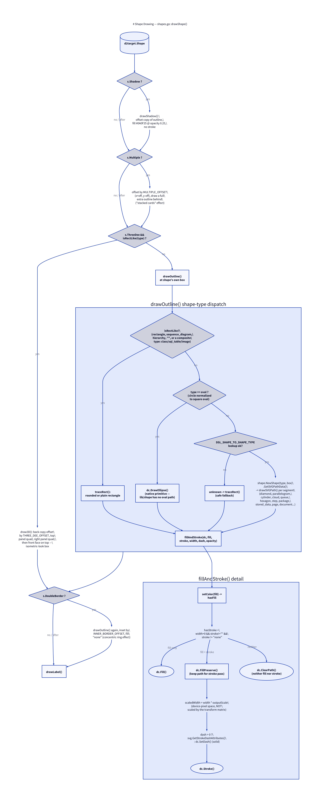

# Shape Drawing: `shapes.go`

Source: [`internal/render/shapes.go`](../internal/render/shapes.go) (216
lines).

Everything about drawing one `d2target.Shape` — its outline, fill, stroke,
and any of D2's shape-level visual modifiers (shadow, "multiple", 3D,
double-border) — plus its label.



## `drawShape` — the modifier pipeline

```go
func drawShape(dc *gg.Context, s d2target.Shape) {
    x, y := float64(s.Pos.X), float64(s.Pos.Y)
    w, h := float64(s.Width), float64(s.Height)

    if s.Shadow {
        drawShadow(dc, s, x, y, w, h)
    }
    if s.Multiple {
        mx, my := x+d2target.MULTIPLE_OFFSET, y-d2target.MULTIPLE_OFFSET
        drawOutline(dc, s, mx, my, w, h, s.Fill, s.Stroke, s.StrokeWidth, s.StrokeDash, s.Opacity)
    }
    if s.ThreeDee && isRectLike(s.Type) {
        draw3D(dc, s, x, y, w, h)
    } else {
        drawOutline(dc, s, x, y, w, h, s.Fill, s.Stroke, s.StrokeWidth, s.StrokeDash, s.Opacity)
    }
    if s.DoubleBorder {
        const inset = d2target.INNER_BORDER_OFFSET
        drawOutline(dc, s, x+inset, y+inset, w-2*inset, h-2*inset, "none", s.Stroke, s.StrokeWidth, s.StrokeDash, s.Opacity)
    }
    drawLabel(dc, s, x, y, w, h)
}
```

Each of D2's shape modifiers is independent and stacks in a fixed order:

1. **Shadow** (if set) is drawn first, so everything else sits on top of it.
2. **Multiple** (if set) draws one extra full outline, offset up-and-right
   by `d2target.MULTIPLE_OFFSET`, *behind* the main shape — the "stacked
   cards" look D2 uses to represent repeated/multiple instances of a shape.
3. **The shape itself** — either the isometric `draw3D` treatment (only for
   rect-like shapes; see `isRectLike` below) or a plain `drawOutline` at its
   own box.
4. **Double border** (if set) draws a second, inset outline with `fill:
   "none"`, producing a concentric-ring effect, inset by
   `d2target.INNER_BORDER_OFFSET` on each side.
5. **Label**, always last, on top of everything.

`ThreeDee` and `DoubleBorder` are mutually exclusive-in-practice (D2 doesn't
combine them meaningfully), but the code doesn't need to special-case that —
`draw3D` draws its own front face at the plain box, and the double-border
pass would simply draw an inset ring on top of that front face if both were
somehow set.

## `isRectLike` and the composite-shape fallback

```go
var compositeShapeTypes = map[string]bool{
    d2target.ShapeClass:    true,
    d2target.ShapeSQLTable: true,
    d2target.ShapeImage:    true,
}

func isRectLike(shapeType string) bool {
    return shapeType == d2target.ShapeRectangle || shapeType == d2target.ShapeSequenceDiagram ||
        shapeType == d2target.ShapeHierarchy || shapeType == "" || compositeShapeTypes[shapeType]
}
```

D2's own SVG renderer (`d2svg`) draws `class`, `sql_table`, and `image`
shapes with bespoke, multi-element SVG (a table of rows for `sql_table`, a
header bar + field list for `class`, an actual `<image>` element for
`image`) rather than one filled/stroked outline path. This renderer doesn't
implement any of that — those three types are deliberately drawn as a plain
rounded rectangle, treated identically to a real `rectangle` shape by
`isRectLike`. This is a known, documented simplification, not an oversight.

## `drawOutline` — shape-type dispatch

The core outline-tracing function, reused for a shape's main body as well
as its shadow, "multiple", and double-border decorations (which is why it
takes an explicit `x, y, w, h, fill, stroke, ...` rather than reading
straight from `s`):

```go
switch {
case isRectLike(s.Type):
    traceRect(dc, s.BorderRadius, x, y, w, h)
case s.Type == d2target.ShapeOval:
    dc.DrawEllipse(x+w/2, y+h/2, w/2, h/2)
default:
    shapeType, ok := d2target.DSL_SHAPE_TO_SHAPE_TYPE[s.Type]
    if !ok {
        traceRect(dc, s.BorderRadius, x, y, w, h) // safe fallback
        return
    }
    box := geo.NewBox(geo.NewPoint(x, y), w, h)
    shp := shape.NewShape(shapeType, box)
    for _, pathData := range shp.GetSVGPathData() {
        drawSVGPath(dc, pathData)
        fillAndStroke(dc, ...)
    }
}
```

Three branches:

1. **Rect-like** → `traceRect`: a rounded rectangle if `BorderRadius > 0`,
   else a plain one.
2. **Oval** → `dc.DrawEllipse` directly. This is called out in a comment as
   a deliberate special case: D2's `lib/shape` package has no path geometry
   for ovals at all (D2's own SVG renderer emits a native `<ellipse>`
   element instead of a `<path>`), so routing an oval through the generic
   `default` branch below would silently produce an empty path and draw
   nothing. Circles are normalized by the D2 compiler to an oval with
   `width == height` before this code ever sees them, so there's no separate
   circle case.
3. **Everything else** (diamond, parallelogram, cylinder, cloud, queue,
   hexagon, step, package, stored_data, page, document, ...) → looked up in
   `d2target.DSL_SHAPE_TO_SHAPE_TYPE`, then `shape.NewShape(...).GetSVGPathData()`
   is used to get D2's own path geometry for that shape, replayed via
   `drawSVGPath` (see [`svgpath.go`](#svgpathgo-replaying-d2s-path-data) below). An unrecognized type
   falls back to a plain rectangle rather than erroring — a shape always
   gets *some* visible outline even for a shape type this renderer doesn't
   know about.

This is the key place D2's own geometry code (`oss.terrastruct.com/d2/lib/shape`)
is reused rather than reimplemented: every non-rectangular, non-oval shape's
exact outline math (where a hexagon's corners are, how a cylinder's curve is
drawn, etc.) comes straight from D2.

## `draw3D`

Approximates D2's isometric-look 3D rectangle with four separate fill+stroke
passes, each using the shape's own fill/stroke color:

1. A **back copy** of the rectangle, offset up-and-right by
   `d2target.THREE_DEE_OFFSET`.
2. A **top panel** — a quadrilateral connecting the front-top edge to the
   back-top edge.
3. A **right panel** — a quadrilateral connecting the front-right edge to
   the back-right edge.
4. The **front face**, drawn last (on top of the other three).

## `drawShadow`

```go
func drawShadow(dc *gg.Context, s d2target.Shape, x, y, w, h float64) {
    sx, sy := x+d2target.SHADOW_SIZE_X, y+d2target.SHADOW_SIZE_Y
    drawOutline(dc, s, sx, sy, w, h, "#0A0F25", "none", 0, 0, 0.25)
}
```

D2's shadow is an SVG drop-shadow filter (blur + offset). This renderer has
no blur primitive, so it approximates the effect with a solid, offset,
25%-opacity copy of the shape's own outline in a fixed dark navy
(`#0A0F25`), no stroke. Visually close for small shadow offsets, but it will
look more like a hard-edged silhouette than a soft blur if zoomed in.

## `fillAndStroke`

The shared fill/stroke logic for every outline drawn above:

```go
func fillAndStroke(dc *gg.Context, fill, stroke string, strokeWidth int, strokeDash, opacity float64) {
    hasFill := setColor(dc, fill, opacity)
    hasStroke := strokeWidth > 0 && stroke != "" && stroke != "none"

    if hasFill && !hasStroke {
        dc.Fill()
        return
    }
    if hasFill {
        dc.FillPreserve()
    }
    if hasStroke {
        scaledWidth := float64(strokeWidth) * outputScale
        setColor(dc, stroke, opacity)
        dc.SetLineWidth(scaledWidth)
        if strokeDash > 0 {
            dashSize, gapSize := svg.GetStrokeDashAttributes(scaledWidth, strokeDash)
            dc.SetDash(dashSize, gapSize)
        } else {
            dc.SetDash()
        }
        dc.Stroke()
        return
    }
    if !hasFill {
        dc.ClearPath()
    }
}
```

Four outcomes, matching the four combinations of "has a fill" / "has a
stroke":

- **Fill only** → `dc.Fill()` (consumes the current path).
- **Fill and stroke** → `dc.FillPreserve()` (fills but keeps the path
  around), then strokes the same path.
- **Stroke only** → skips straight to the stroke branch (the `hasFill`
  branches above are no-ops when `setColor` returned `false`).
- **Neither** → `dc.ClearPath()`, so a shape with `fill: none` and no stroke
  (or `strokeWidth: 0`) doesn't leave a stray path lingering in the
  context's state for the next draw call to accidentally pick up.

`scaledWidth := float64(strokeWidth) * outputScale` is the stroke-specific
instance of the `outputScale` compensation described in
[Render Pipeline](05-render-pipeline.md) — stroke width is a device-pixel
quantity in `gg`, unaffected by `dc.Scale`.

`svg.GetStrokeDashAttributes` is reused from D2's own `lib/svg` package so
that a given `strokeDash` value produces the same dash/gap pattern here as
it would in D2's SVG output.

## `drawLabel` and `drawMultilineAt`

```go
func drawLabel(dc *gg.Context, s d2target.Shape, x, y, w, h float64) {
    if s.Label == "" {
        return
    }
    labelW, labelH := float64(s.LabelWidth), float64(s.LabelHeight)
    box := geo.NewBox(geo.NewPoint(x, y), w, h)
    pos := label.FromString(s.LabelPosition)
    tl := pos.GetPointOnBox(box, label.PADDING, labelW, labelH)

    dc.SetFontFace(fontFace(s.Bold, float64(s.FontSize)))
    setColor(dc, s.GetFontColor(), 1)
    drawMultilineAt(dc, s.Label, tl.X+labelW/2, tl.Y+labelH/2)
}
```

`label.FromString(s.LabelPosition)` and `.GetPointOnBox(...)` are reused
from D2's own `lib/label` package — the same positioning logic
(`top-center`, `outside-bottom-left`, etc.) D2's SVG renderer uses, so a
label lands in the same place here as it would there.

`drawMultilineAt` is the shared text-drawing routine (also used for
connection labels — see [edges.go](07-edges.md)):

```go
func drawMultilineAt(dc *gg.Context, text string, x, y float64) {
    const lineSpacing = 1.2
    dx, dy := dc.TransformPoint(x, y)
    dc.Push()
    dc.Identity()

    lines := strings.Split(text, "\n")
    h := float64(len(lines))*dc.FontHeight()*lineSpacing - (lineSpacing-1)*dc.FontHeight()
    ly := dy - h/2
    for _, line := range lines {
        dc.DrawStringAnchored(line, dx, ly, 0.5, 1)
        ly += dc.FontHeight() * lineSpacing
    }
    dc.Pop()
}
```

Two subtleties, both explained in source comments:

1. **No re-wrapping.** It splits strictly on literal `"\n"` and draws each
   line as-is — it never calls `gg`'s own wrapping helper
   (`DrawStringWrapped`) against a re-derived width. D2 already measured
   `s.Label` with the `Ruler` during compilation and reserved
   `LabelWidth`/`LabelHeight` for exactly the wrapping it chose; re-wrapping
   here with `gg`'s own metrics could disagree (different rounding/kerning)
   and produce an extra line that overflows the space D2 already reserved
   for it, into the shape's border.
2. **Manual coordinate-space handling.** `gg` measures text against the
   font face directly, ignoring the context's transform matrix. Since
   `fontFace()` already bakes `outputScale` into the face's point size (see
   [Color & Fonts](08-color-and-fonts.md)), the target point must be
   resolved into that same device-pixel space *before* drawing — hence
   `dc.TransformPoint(x, y)` to get device coordinates, then
   `dc.Push()` / `dc.Identity()` to temporarily zero out the transform while
   drawing, then `dc.Pop()` to restore it. Without this, text would be
   double-scaled (once by the font's already-scaled size, once by the
   context's own scale transform).

## `svgpath.go` — replaying D2's path data

Source: [`internal/render/svgpath.go`](../internal/render/svgpath.go) (52
lines).

```go
func drawSVGPath(dc *gg.Context, pathData string) {
    tokens := strings.Fields(pathData)
    var cx, cy float64
    i := 0
    next := func() float64 {
        v, _ := strconv.ParseFloat(tokens[i], 64)
        i++
        return v
    }

    dc.NewSubPath()
    for i < len(tokens) {
        cmd := tokens[i]
        i++
        switch cmd {
        case "M": cx, cy = next(), next(); dc.MoveTo(cx, cy)
        case "L": cx, cy = next(), next(); dc.LineTo(cx, cy)
        case "H": cx = next(); dc.LineTo(cx, cy)
        case "V": cy = next(); dc.LineTo(cx, cy)
        case "C":
            x1, y1, x2, y2, x3, y3 := next(), next(), next(), next(), next(), next()
            dc.CubicTo(x1, y1, x2, y2, x3, y3)
            cx, cy = x3, y3
        case "Z": dc.ClosePath()
        }
    }
}
```

`shape.NewShape(...).GetSVGPathData()` (from D2's `lib/shape` package)
returns path strings in the subset of the SVG path mini-language D2 itself
emits — always **absolute**, space-separated numeric coordinates (no
relative commands like `l`/`h`/`v`/`c`, no compact comma-separated number
runs) — so the tokenizer here can be this simple: split on whitespace,
consume one command letter followed by however many numeric arguments that
command takes.

Supported commands: `M` (move), `L` (line), `H`/`V` (horizontal/vertical
line, reusing the other axis's current position), `C` (cubic Bézier), `Z`
(close path). This is deliberately not a general SVG path parser — no `A`
(arc), no relative variants, no shorthand curve commands — because it only
ever needs to parse D2's own generator output, which never emits those.

This function is what lets [`drawOutline`](#drawoutline--shape-type-dispatch)
reuse D2's exact shape geometry for every non-rectangle, non-oval shape type
instead of hand-coding path math (corner positions, curve control points,
etc.) per shape type in this codebase.
