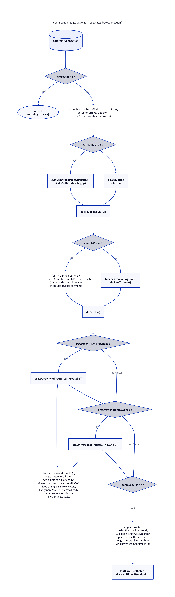

# Connection Drawing: `edges.go`

Source: [`internal/render/edges.go`](../internal/render/edges.go) (111
lines).

Everything about drawing one `d2target.Connection`: its route (straight or
curved), arrowheads at either end, and its label.



## `drawConnection`

```go
func drawConnection(dc *gg.Context, conn d2target.Connection) {
    route := conn.Route
    if len(route) < 2 {
        return
    }
    ...
}
```

A route with fewer than 2 points can't be drawn (no line segment exists) and
is silently skipped — not treated as an error, since D2's layout engine is
trusted to only produce degenerate routes in genuinely degenerate diagrams
(e.g. a self-loop edge case), not as a sign of a bug in this renderer.

### Stroke setup

```go
scaledWidth := float64(conn.StrokeWidth) * outputScale
setColor(dc, conn.Stroke, conn.Opacity)
dc.SetLineWidth(scaledWidth)
if conn.StrokeDash > 0 {
    dashSize, gapSize := svg.GetStrokeDashAttributes(scaledWidth, conn.StrokeDash)
    dc.SetDash(dashSize, gapSize)
} else {
    dc.SetDash()
}
```

Identical pattern to `fillAndStroke` in [shapes.go](06-shapes.md): stroke
width is scaled explicitly by `outputScale` because `gg` applies it in
device pixels, and dash attributes are computed via D2's own
`lib/svg.GetStrokeDashAttributes` so dash/gap sizing matches D2's SVG
output.

### Route: straight segments vs. curves

```go
dc.MoveTo(route[0].X, route[0].Y)
if conn.IsCurve {
    i := 1
    for ; i < len(route)-2; i += 3 {
        dc.CubicTo(route[i].X, route[i].Y, route[i+1].X, route[i+1].Y, route[i+2].X, route[i+2].Y)
    }
} else {
    for i := 1; i < len(route); i++ {
        dc.LineTo(route[i].X, route[i].Y)
    }
}
dc.Stroke()
```

`conn.Route` is a flat `[]*geo.Point`. For curved connections, D2 encodes
each cubic Bézier segment as **3 points** (two control points + an
endpoint) following the starting point, so the loop advances `i += 3` and
draws one `CubicTo` per group. For straight connections, every point after
the first is just a `LineTo`.

### Arrowheads

```go
if conn.DstArrow != d2target.NoArrowhead {
    drawArrowhead(dc, route[len(route)-2], route[len(route)-1], conn.Stroke, conn.Opacity)
}
if conn.SrcArrow != d2target.NoArrowhead {
    drawArrowhead(dc, route[1], route[0], conn.Stroke, conn.Opacity)
}
```

```go
func drawArrowhead(dc *gg.Context, from, tip *geo.Point, strokeToken string, opacity float64) {
    angle := math.Atan2(tip.Y-from.Y, tip.X-from.X)
    const spread = 0.4 // radians
    x1 := tip.X - arrowheadLength*math.Cos(angle-spread)
    y1 := tip.Y - arrowheadLength*math.Sin(angle-spread)
    x2 := tip.X - arrowheadLength*math.Cos(angle+spread)
    y2 := tip.Y - arrowheadLength*math.Sin(angle+spread)

    dc.NewSubPath()
    dc.MoveTo(tip.X, tip.Y)
    dc.LineTo(x1, y1)
    dc.LineTo(x2, y2)
    dc.ClosePath()
    setColor(dc, strokeToken, opacity)
    dc.Fill()
}
```

D2 supports several distinct arrowhead *shapes* (triangle, diamond, circle,
cross, "arrow", ...). This renderer implements exactly **one**: a filled
triangle, `arrowheadLength = 10` units long with a `±0.4` radian spread
around the line's angle at the tip. Every non-`NoArrowhead` value renders
identically as this triangle — which happens to be D2's own default
arrowhead style (`d2target.DefaultArrowhead`), so the common case looks
right, but a diagram explicitly requesting e.g. a diamond or circle
arrowhead will silently get a triangle instead. This is a known, documented
gap rather than a bug.

The source (`from`) and destination (`tip`) points for each arrowhead are
taken from the second-and-last, and first-and-second, points of the route
respectively — i.e. the arrowhead's direction is derived from the route's
own local direction at that end, not from the overall start-to-end vector.

### Edge label

```go
func drawEdgeLabel(dc *gg.Context, conn d2target.Connection, route []*geo.Point) {
    if conn.Label == "" {
        return
    }
    mx, my := midpoint(route)

    labelW, labelH := float64(conn.LabelWidth), float64(conn.LabelHeight)
    dc.SetHexColor(theme.Neutrals.N7)
    dc.DrawRectangle(mx-labelW/2-2, my-labelH/2, labelW+4, labelH)
    dc.Fill()

    dc.SetFontFace(fontFace(conn.Bold, float64(conn.FontSize)))
    setColor(dc, conn.GetFontColor(), 1)
    drawMultilineAt(dc, conn.Label, mx, my)
}
```

Reuses `drawMultilineAt` from [shapes.go](06-shapes.md#drawlabel-and-drawmultilineat)
— the exact same multi-line-safe text drawing routine, positioned at the
route's geometric midpoint rather than a label-box top-left like shape
labels are.

**The background rect:** without it, the label's greyish text is drawn
directly on top of the stroked line, so the line visibly runs through the
glyphs — worst on curved transition arrows where the stroke crosses the
text diagonally. D2's own SVG renderer avoids this with an SVG `<mask>`
that cuts a hole in the connection's stroke behind the label
(`d2svg.makeLabelMask`); since this renderer has no SVG masking, it
approximates the same effect by painting an opaque rect in the page
background color (`theme.Neutrals.N7`) before drawing the text, so the
line appears to gap around the label instead.

**Known limitation:** this only works because the common case is a label
sitting on bare canvas. If a connection's label happens to land on top of
*another shape's* differently-colored fill instead — rather than just the
line and the page background — the opaque rect paints over that fill too,
which would look wrong. D2's SVG mask doesn't have this problem, since it
only ever removes stroke, never paints over unrelated content underneath.
Fixing that properly would mean tracking what's actually beneath the label
(or drawing labels in a separate masked layer) rather than assuming page
background — not done here, since a label overlapping another shape is an
uncommon layout in practice.

### `midpoint`

```go
func midpoint(route []*geo.Point) (x, y float64) {
    total := 0.0
    for i := 1; i < len(route); i++ {
        total += geo.EuclideanDistance(route[i-1].X, route[i-1].Y, route[i].X, route[i].Y)
    }
    target := total / 2
    walked := 0.0
    for i := 1; i < len(route); i++ {
        seg := geo.EuclideanDistance(route[i-1].X, route[i-1].Y, route[i].X, route[i].Y)
        if walked+seg >= target {
            t := 0.0
            if seg > 0 {
                t = (target - walked) / seg
            }
            return route[i-1].X + t*(route[i].X-route[i-1].X),
                route[i-1].Y + t*(route[i].Y-route[i-1].Y)
        }
        walked += seg
    }
    last := route[len(route)-1]
    return last.X, last.Y
}
```

Two-pass algorithm: first computes the route's **total Euclidean length**
by summing every consecutive-point distance (treating the route as a
polyline — this does not account for `IsCurve` routes actually being
smooth Béziers, so the midpoint of a curved edge's label position is an
approximation based on its control polygon's length, not the true arc
length of the curve). Second pass walks the same segments accumulating
distance until it finds the segment containing the halfway point, then
linearly interpolates (`t`) within that segment to the exact point.

The final `return last.X, last.Y` is a defensive fallback for a
single-point or otherwise degenerate route where the walk never finds a
segment satisfying `walked+seg >= target` — it can't actually be reached
for `len(route) >= 2` given the two-pass logic, but keeps `midpoint` total
and panic-free for any input.

Notably, `midpoint` is only ever called from `drawEdgeLabel`, and
`drawConnection` already returns early for `len(route) < 2`, so in practice
`midpoint` is never invoked with fewer than 2 points — but see
[Testing Strategy](09-testing.md) for the unit test that exercises the
single-point case directly regardless.
