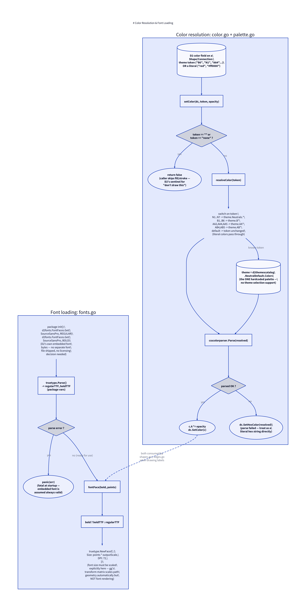

# Color & Fonts: `color.go`, `palette.go`, `fonts.go`

Source:
[`internal/render/color.go`](../internal/render/color.go) (28 lines),
[`internal/render/palette.go`](../internal/render/palette.go) (56 lines),
[`internal/render/fonts.go`](../internal/render/fonts.go) (42 lines).

Two small, related subsystems: resolving whatever color value D2 put on a
shape/connection field into something `gg` can draw with, and loading a
`font.Face` at the right size for a label.



## Why color resolution is needed at all

D2's compiled `d2target.Shape`/`Connection` color fields (`Fill`, `Stroke`,
font color) don't always contain a literal color. For the default theme,
they come back as **theme-slot tokens** — short strings like `"B6"`,
`"N1"`, `"AA4"` — that D2's own SVG renderer resolves by embedding a CSS
stylesheet mapping those tokens to hex values, generated from the active
theme. Since this renderer never produces or reads any CSS, that resolution
step has to happen directly in Go instead.

If a `.d2` file sets an explicit literal color (`red`, `#ff0000`), that
string never matches a known token and passes through unchanged — the whole
scheme degrades gracefully to "just use the literal" for non-themed colors.

## `palette.go` — the one hardcoded theme

```go
var theme = d2themescatalog.NeutralDefault.Colors
```

This is D2's default theme (ID `0`, "Neutral Default"), and it's the
**only** theme this renderer supports — there is no theme selection
mechanism, even though D2 itself ships many. A `.d2` file's own
`vars.d2-config.theme-id` (if set) is simply not honored, since this
renderer bypasses D2's theme/CSS machinery entirely and imports the
`NeutralDefault` colors directly as a Go value.

```go
func resolveColor(token string) string {
    switch token {
    case "N1": return theme.Neutrals.N1
    // ... N2-N7
    case "B1": return theme.B1
    // ... B2-B6
    case "AA2": return theme.AA2
    case "AA4": return theme.AA4
    case "AA5": return theme.AA5
    case "AB4": return theme.AB4
    case "AB5": return theme.AB5
    default: return token
    }
}
```

A flat switch over every token this renderer knows about. `N1`–`N7` are
neutrals (background/foreground grays — `N7` specifically is used as the
canvas background color in [`render.Render`](05-render-pipeline.md)); `B1`–`B6`
are the primary brand-blue shades; `AA2`/`AA4`/`AA5` and `AB4`/`AB5` are
accent colors A and B at various shades. Anything not matched (a literal
color, or a token from a different theme that was never wired in) is
returned as-is.

## `color.go` — applying a resolved color

```go
func setColor(dc *gg.Context, token string, opacity float64) bool {
    if token == "" || token == "none" {
        return false
    }
    resolved := resolveColor(token)
    c, err := csscolorparser.Parse(resolved)
    if err != nil {
        dc.SetHexColor(resolved)
        return true
    }
    c.A *= opacity
    dc.SetColor(c)
    return true
}
```

`""` and `"none"` are D2's sentinel values for "don't draw this" (e.g. a
shape with no fill) — `setColor` returns `false` for both, and every caller
(`fillAndStroke` in shapes.go, the stroke setup in edges.go) uses that
return value to decide whether to skip the fill or stroke operation
entirely, rather than drawing with some default/garbage color.

For any other token, `resolveColor` is applied first (theme token → hex, or
pass-through), then `csscolorparser.Parse` — a general CSS color parser
supporting hex, `rgb()`, named colors (`"red"`), etc. — converts it to an
`{R,G,B,A}` struct. `opacity` is multiplied into the alpha channel here,
which is why callers pass a shape/connection's `Opacity` field straight
through rather than pre-multiplying it themselves.

If parsing fails (returns `false, err` is unreachable here since only `err`
is checked, but practically: an unparseable string), the code falls back to
`dc.SetHexColor(resolved)` — treating the string as a raw hex color
directly rather than propagating the parse error. This means a genuinely
malformed color string won't cause a compile or render failure; worst case
it produces `gg`'s own fallback behavior for an invalid hex string.

## `fonts.go` — D2's own embedded font, scaled

```go
var regularTTF, boldTTF *truetype.Font

func init() {
    regularBytes := d2fonts.FontFaces.Get(d2fonts.Font{Family: d2fonts.SourceSansPro, Style: d2fonts.FONT_STYLE_REGULAR})
    boldBytes := d2fonts.FontFaces.Get(d2fonts.Font{Family: d2fonts.SourceSansPro, Style: d2fonts.FONT_STYLE_BOLD})

    var err error
    regularTTF, err = truetype.Parse(regularBytes)
    if err != nil { panic(err) }
    boldTTF, err = truetype.Parse(boldBytes)
    if err != nil { panic(err) }
}
```

Rather than shipping a separate font file (and the licensing decision that
would require), this renderer reuses the exact TTF bytes D2 already embeds
for its own SVG output (`SourceSansPro`, regular and bold). Parsed once at
package `init()` time into two package-level `*truetype.Font` values. A
parse failure here `panic`s — deliberately, since the embedded bytes are
assumed to always be valid (they ship inside a pinned dependency version),
so a failure would indicate something seriously wrong worth failing loudly
and immediately, not a recoverable runtime condition.

```go
func fontFace(bold bool, points float64) font.Face {
    f := regularTTF
    if bold {
        f = boldTTF
    }
    return truetype.NewFace(f, &truetype.Options{
        Size: points * outputScale,
        DPI:  72,
    })
}
```

`fontFace` is the single call site every label-drawing function
([shapes.go](06-shapes.md#drawlabel-and-drawmultilineat),
[edges.go](07-edges.md#edge-label)) goes through to get a `font.Face` at a
given point size. `points * outputScale` is the font-specific instance of
the `outputScale` compensation pattern described in
[Render Pipeline](05-render-pipeline.md#scale-and-outputscale): `gg`'s
transform matrix scales path/shape geometry automatically, but a
`font.Face`'s point size is fixed at creation time and unaffected by any
later `dc.Scale` call, so it has to be baked in here, upfront, explicitly.

A new `font.Face` is constructed on every call rather than cached — for the
diagram sizes this renderer targets, this hasn't been a measured
performance concern, but it's worth knowing if profiling ever points here
for a diagram with hundreds of labels.
